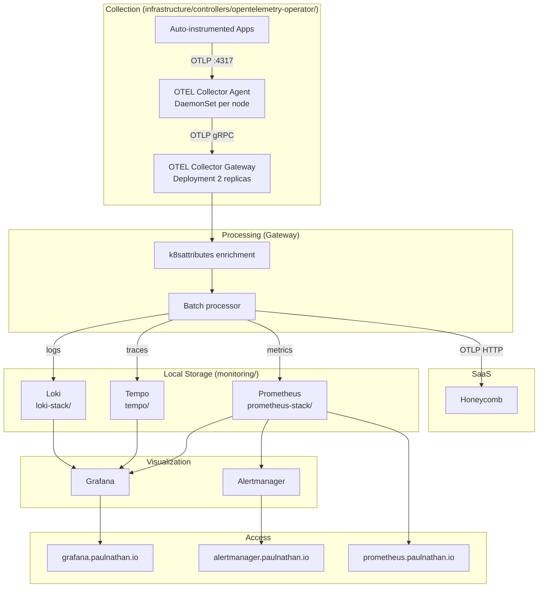

# Monitoring & Observability Stack

Complete observability for Kubernetes with metrics, logs, traces, and dual-ship to Honeycomb.

## Architecture



## Components

| Component | Location | Purpose |
|-----------|----------|---------|
| **OTEL Operator** | `infrastructure/controllers/opentelemetry-operator/` | Manages Collectors + auto-instrumentation |
| **OTEL Agent** | Same (CRD: `collector-agent.yaml`) | DaemonSet, scrapes pod logs via filelog, receives OTLP |
| **OTEL Gateway** | Same (CRD: `collector-gateway.yaml`) | Centralized processing, fan-out to all backends |
| **Prometheus** | `monitoring/prometheus-stack/` | Metrics storage, alerting, Grafana |
| **Loki** | `monitoring/loki-stack/` | Log storage (S3 on RustFS) |
| **Tempo** | `monitoring/tempo/` | Trace storage (S3 on RustFS) |
| **Honeycomb** | External SaaS | All signals via OTLP HTTP |

## Auto-Instrumentation

The OTEL Operator injects OTEL SDKs into pods automatically. Add an annotation to opt-in:

```yaml
metadata:
  annotations:
    instrumentation.opentelemetry.io/inject-python: "true"
    # also: inject-nodejs, inject-java, inject-go, inject-dotnet
```

Supported languages: Python, Node.js, Java, Go, .NET.

## Kubernetes Metrics: Two Pipelines

```
                    kubelet :10250/metrics
                   /                       \
        Prometheus scrapes              metrics-server polls
               ↓                               ↓
      stores in time-series DB         holds latest snapshot in memory
               ↓                               ↓
      Grafana, Alertmanager            VPA, HPA, kubectl top
```

| | **Prometheus** | **metrics-server** |
|---|---|---|
| **What it stores** | Historical time-series (15 day retention) | Last ~30 seconds only, in-memory |
| **Consumers** | Grafana, Alertmanager | VPA, HPA, `kubectl top` |
| **Installed via** | `monitoring/prometheus-stack/` (Wave 5) | `infrastructure/controllers/metrics-server/` (Wave 4) |

## Storage Backends

| Component | Storage | Location |
|-----------|---------|----------|
| Prometheus | Longhorn PVC (20Gi) | Local cluster |
| Grafana | Longhorn PVC (5Gi) | Local cluster |
| Alertmanager | Longhorn PVC (2Gi) | Local cluster |
| Loki | RustFS S3 (`loki` bucket) | TrueNAS 192.168.10.133:30293 |
| Tempo | RustFS S3 (`tempo` bucket) | TrueNAS 192.168.10.133:30293 |

## Access

| Service | URL |
|---------|-----|
| Grafana | https://grafana.paulnathan.io |
| Prometheus | https://prometheus.paulnathan.io |
| Alertmanager | https://alertmanager.paulnathan.io |
| Loki | https://loki.paulnathan.io |
| Honeycomb | https://ui.honeycomb.io |

## Key Files

- Custom ServiceMonitors: `monitoring/prometheus-stack/custom-servicemonitors.yaml`
- Custom alerts: `monitoring/prometheus-stack/custom-alerts.yaml`
- GPU alerts/dashboard: `monitoring/prometheus-stack/gpu-alerts.yaml`, `gpu-dashboard.yaml`
- OTEL Collectors: `infrastructure/controllers/opentelemetry-operator/collector-*.yaml`
- Auto-instrumentation: `infrastructure/controllers/opentelemetry-operator/instrumentation.yaml`

## Retention

| Signal | Local | Honeycomb |
|--------|-------|-----------|
| Metrics | 15 days (Prometheus) | Per plan |
| Logs | 30 days (Loki) | Per plan |
| Traces | 72 hours (Tempo) | Per plan |
| Alerts | 72 hours (Alertmanager) | N/A |

## Troubleshooting

```bash
# Check OTEL Collector pods
kubectl get pods -n opentelemetry

# Check Collector logs
kubectl logs -n opentelemetry -l app.kubernetes.io/component=opentelemetry-collector

# Check Prometheus targets
# Visit: https://prometheus.paulnathan.io/targets

# Check Loki is receiving logs
# In Grafana, query: {namespace=~".+"}

# Check Honeycomb
# Visit: https://ui.honeycomb.io — look for datasets with k8s.namespace.name attribute
```
